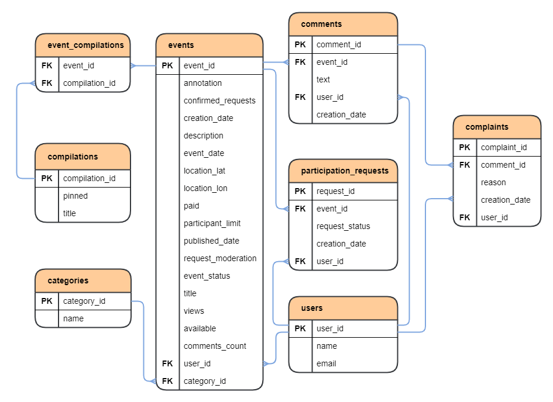

# ExploreWithMe

### Технологический стек:

1. Java 11;
2. Spring Boot;
3. Apache Maven;
4. Lombok;
5. PostgreSQL;
6. Docker;
7. Postman;
8. Hibernate.

## _Описание проекта._
       
Backend часть приложения ExploreWithMe (англ. _"исследуй со мной"_).  

Приложение помогает пользователям делиться информацией об интересных событиях и находить компанию для участия в них. 
Оно делает проще планирование своего досуга: поиск информации о событии, переговоры с другими участниками. Проще говоря 
приложение является аналогом "афиши", в которой можно предложить какое-либо событие от выставки до похода в кино и 
собрать компанию для участия в нём.  

Относительно уровня доступа, приложение условно поделено на три части: приватную, публичную и административную. В 
соответствии с этим, в зависимости от уровня доступа (пользователь, гость, модератор) доступны те или инные функции 
приложения, и действия с сущностями.

Также есть разделение приложения на модули: два микросервиса. Основной отвечает за работу с пользователями - main 
service. Второй отвечает за сбор статистики просмотров - stats service.

### Ключевой функционал приложения:

Пользователь создаёт событие, другие пользователи могут послать запрос на участие в нём. Далее инициатор мероприятия 
может принять или отклонить запрос на участие. Модератор имеет возможность создавать подборки событий для главной 
страницы. Есть возможность комментировать события, а также отправить жалобу на комментарии содержащие нарушения.

## _Как запустить?_

1. Требуется ПК с Unix подобной ОС: Mac OS, Linux (например Ubuntu). Для остальных ОС требуется поднять виртуальную 
   машину (например с помощью VirtualBox, WSL) с одной из Unix подобных ОС.
2. Установить Docker на ПК;
3. Клонировать репозиторий на свой ПК;
4. Сойдать jar файлы из модулей проекта, например через Intellij IDEA с помощью команды mvn package (при повторной 
   пересборке рекомендуется использовать чистую сборку: mvn clean package);
5. Запустить приложение через терминал, из папки проекта, командой docker-compose up

## _ER-диаграммы БД проекта._

### Схема БД основного сервиса (main-service)

### Схема БД сервиса статистики (stats-service)

